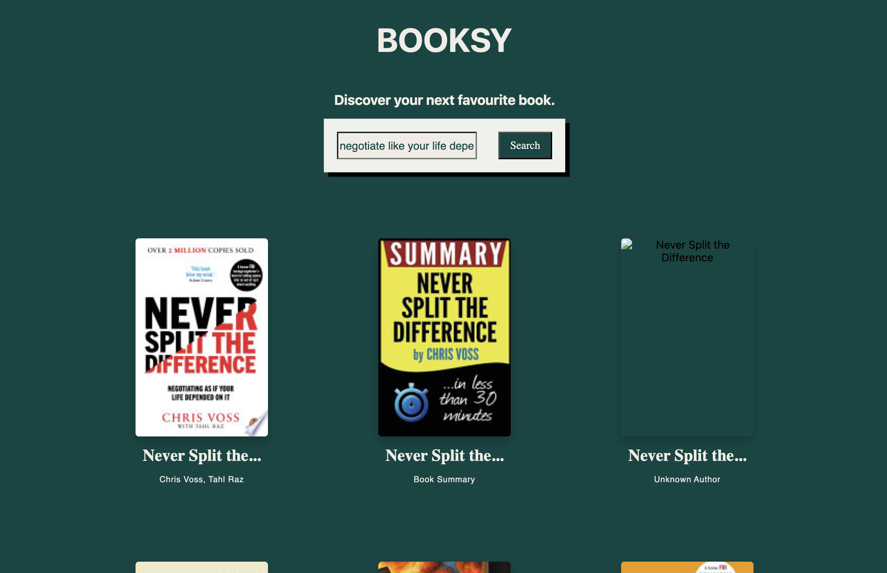

# Booksy - Google Books Search

## Overview

Booksy is a responsive React application that allows users to search the Google Books database and explore book information through a clean, modern interface.

This project was built to strengthen my React fundamentals by working with component-based architecture, API integration, state management, asynchronous programming, and React Testing Library.

## Screenshot

## Features

- Search books using the Google Books API
- Responsive grid layout
- Book cards displaying cover, title and author
- Book details displayed in a modal
- Loading and error states
- Component testing with React Testing Library and Vitest

## Built With

- React
- Vite
- SCSS Modules
- JavaScript (ES6)
- Google Books API
- React Testing Library
- Vitest

## Key Concepts

- React components
- Props
- State with `useState`
- Side effects with `useEffect`
- API requests using Fetch
- Async/Await
- Conditional rendering
- Component composition
- React Testing Library
- Vitest

## How It Works

1. The user enters a book title into the search bar.
2. A request is sent to the Google Books API.
3. Matching books are displayed in a responsive grid.
4. Selecting a book opens a modal with additional information including author, publication date, category and description.

## Future Improvements

- Book favourites
- Pagination or infinite scrolling
- Search suggestions
- Filters by author or category
- Dark/Light mode

---

This project was completed as part of the \_nology Software Engineering program.
